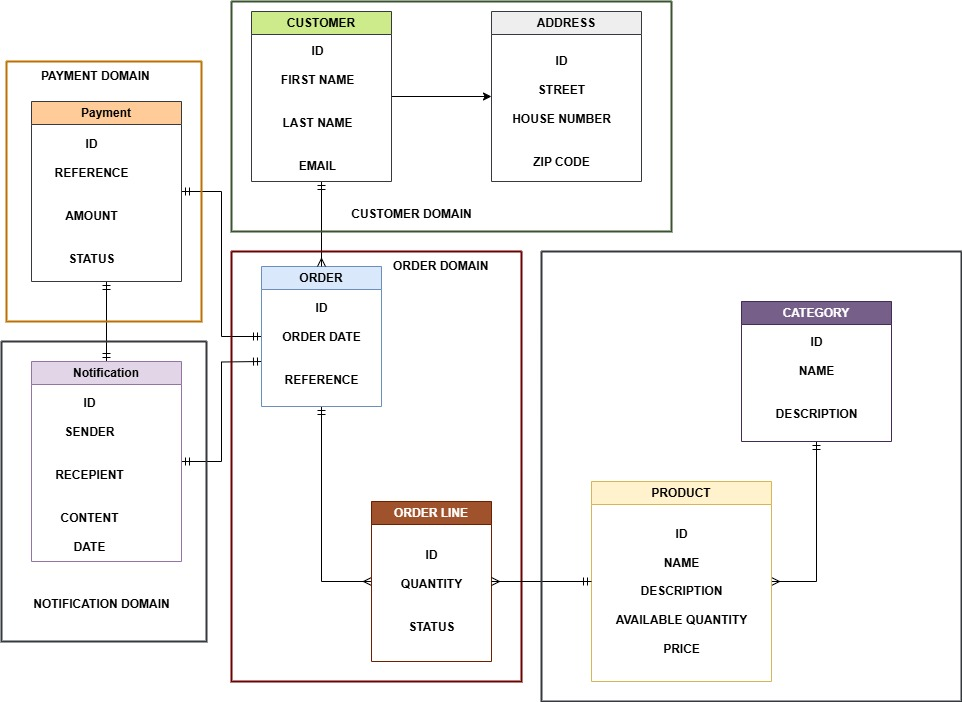

# E - COMMERCE APPLICATION

## OVERVIEW
This is the design of an E - commerce application with microservice architecture.

## OBJECTIVES
1. resilience
2. scalability

## TECHNOLOGIES
+ Java 17
+ spring boot 3.2.5
+ spring cloud 2024.0
+ Apache kafka
+ PostgresSQL, MongoDB

## ARCHITECTURAL DESIGN

